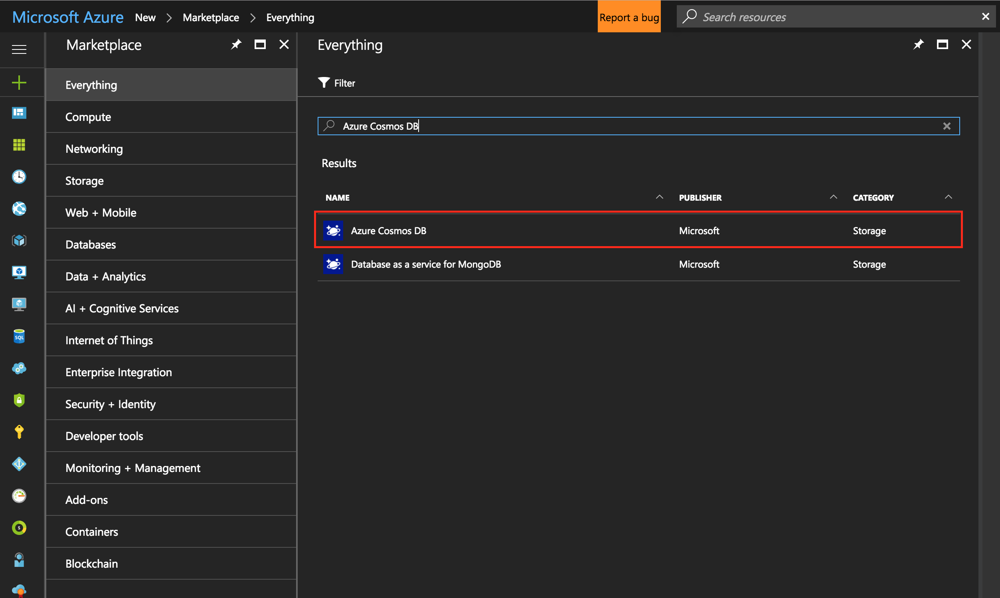
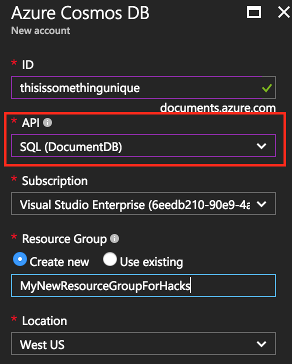
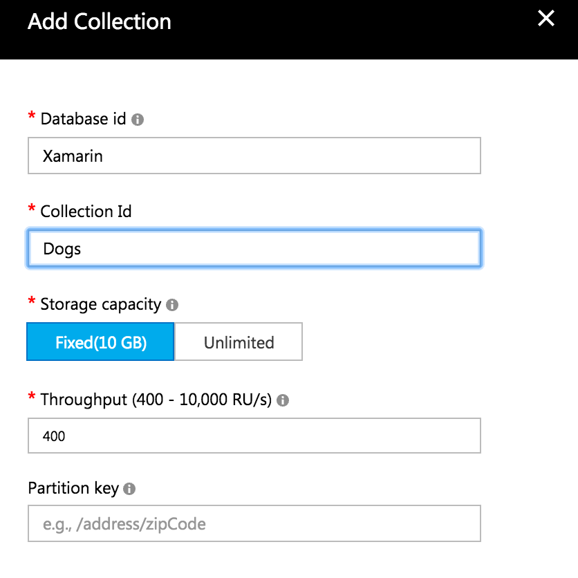

Last updated on 5/23/2017

# Interacting with Cosmos from a Xamarin.Forms applicaiton

Get ready to start digging directly into Cosmos, it's going to be fun!

### Getting your environment setup

We will want to enable local development of Cosmos DB and there is an emulator that you can use. How we work with Cosmos in the emulator or the Azure portal will be very similar. Go [here](https://docs.microsoft.com/en-us/azure/documentdb/documentdb-nosql-local-emulator) to install the Cosmos emulator. Don't worry about playing around here for now, this just gives you the option to debug everything locally in the future. 

### Step 1
We need to get to create our Azure Document DB instance in our Azure Portal. 

1a) Let's Navigate to our Azure portal and create a new instance of "" like below:


1b) When entering your information, make sure you select **SQL (DocumentDB)**


### Step 2
Now we need to create our structure of objects in the database. This is a very abstract concept and different way to think about things if you haven't done NoSQL before. Read up more on it [here](https://docs.microsoft.com/en-us/azure/cosmos-db/create-documentdb-dotnet) if you want.

2a) Navigate to your Cosmos DB instance after it has been created

2b) Select **Data Explorer (Preview)** in the menu options

2c) Click **New Collection** in the top left corner

2d) Next let's name our Database Id *Xamarin* for this example. The Database Id will be used later on when we connect to it. The sectioning out here is similar to our SQL database on our SQL Server where our SQL Database will have multiple tables. But remember that Cosmos DB != SQL and it isn't SQL, but you can use SQL query syntax. Confused? Watch this [two minute video](https://azure.microsoft.com/en-us/resources/videos/what-is-azure-documentdb/) to learn a bit more.

2e) Nexts let's name our Collection Id *Dogs* for this example. The Collection Id can be thought of as our mobel object we want to use in the Xamarin App. 



2f) Once everything has been created, you'll see the left menu is populated with our new database and collection. Select **Dog** or whatever you called your collection and click on **Documents**. 

2g) Click on **New Document** and we will be able to define our data model through a JSON payload. Enter the following for our model:
```json
{
    "id": "1",
    "name": "olive",
    "furColor": "brown/black"
}
```

Once you save the document, the ID property should get populated. If you want to add more data to your database, just click **New Document** and do the same thing. 

*Note: Every document needs an *id* property and if you don't enter a value for the propery, it will be populated with a `GUID`.

2h) Now we need to grab two values from the **Keys** properties section for our Cosmos DB in the Azure Portal. Exit the **Data Explorer** by clicking the **X** in the top right. Then select **Keys** in the menu options.

2i) Copy the **URI** and **Primary Key**. We will need these later to connect to Cosmos from our Xamarin App.

### Step 3 - Xamarin.Forms Project
Now we have everything setup in Cosmos for us to grab data. 

3a) Create a new Xamarin.Forms project. 

3b) Next create a new Model in our shared project for our **Dog** object.

```csharp
using Newtonsoft.Json;

public class Dog
{
    [JsonAttribute("id")]
    public string Id {get;set;}
    [JsonAttribute("name")]
    public string Name {get;set;}
    [JsonAttribute("furColor")]
    public string FurColor {get;set;}
}
```

3c) Next we need to create a Page with two labels and a button and stack them together. Go ahead and put that together.

Here is a hint if you need some help:

```csharp
public class ViewOlivePage : ContentPage
{
    public ViewOlivePage()
    {
        var nameLabel = new Label();
        var furColorLabel = new Label();
        var getDataButton = new Button { Text = "Get data from Cosmos" };

        Content = new StackLayout
        {
            Padding = 20,
            Children = {
                nameLabel,
                furColorLabel,
                getDataButton
            }
        }
    }
}
```

3d) Next we will need to create our DocumentDbService. Let's create a static class so we have one instance that can be accessed easily for our example. 

Make sure to grab the URI and Primary Key you wrote copied earlier. If you don't have them, go back to the **Keys** section of the Cosmos DB in your Azure Portal to get them.

```csharp
public static class DocumentDbService
{
    static readonly DocumentClient documentClient = new DocumentClient(new Uri({URI from Azure Portal}), {PRIMARY KEY from Azure Portal});
    static readonly string DatabaseId = "Xamarin";//This is our Database ID we created in the Azure Portal
    static readonly string CollectionId = "Dog";//This is the name of our model we created in the Azure Portal

    public static async Task<Dog> GetDogByIdAsync(string id)
    {
        var result = await documentClient.ReadDocumentAsync<Dog>(UriFactory.CreateDocumentUri(DatabaseId, CollectionId, id));

        if (result.StatusCode != System.Net.HttpStatusCode.Created)
            return null;

        return result;
    }
}
```

Does it look similar to a `HttpClient` web request? I think it does!

3e) Now we have a simple call to get some doggie info. Next let's wire up our button click to make this work.

```csharp
public class ViewOlivePage : ContentPage
{
    public ViewOlivePage()
    {
        ...

        Content = new StackLayout
        {
            Padding = 20,
            Children = {
                nameLabel,
                furColorLabel,
                getDataButton
            }
        }

        getDataButton.Clicked += async (object sender, EventArgs e) => 
        {
            var dog = await DocumentDbService.GetDogByIdAsync("1");

            Device.BeginInvokeOnMainThread(()=>
            {
                nameLabel.Text = dog.Name;
                furColorLabel.Text = dog.FurColor;
            })
        };
    }
}
```

3f) Last we just need to wire up our page in the `App` class.

```csharp
public class App : Application
{
    public App()
    {
        MainPage = new ViewOlivePage();
    }
}
```

3g) Run the project and have your mind blown. Congratulations! You just connected directly to CosmosDB without having any API layer in between. That is really powerful stuff you just learned.

Now imagine having a service controller that does everything for your CRUD and Query operations of the Cosmos DB in your Xamarin Application. In the next part of this hack, we will create something similar to this but for our API layers.

Hope you enjoyed this!